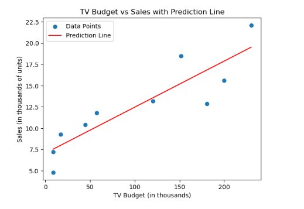

# Add a prediction line to your scatter plot using linear regression with Scikit-Learn

This example demonstrates how to fit a linear regression model to your data using Scikit-Learn and plot both the original data points and the prediction line. This is useful for visualizing the relationship between two variables and seeing how well a linear model fits your data.

```python
import pandas as pd
import numpy as np
import matplotlib.pyplot as plt
from sklearn.linear_model import LinearRegression

# Sample data: TV advertising budget (in thousands) and corresponding sales (in thousands of units)
data = {
    'x': [230.1, 44.5, 17.2, 151.5, 180.8, 8.7, 57.5, 120.2, 8.6, 199.8],
    'y': [22.1, 10.4, 9.3, 18.5, 12.9, 7.2, 11.8, 13.2, 4.8, 15.6]
}
df = pd.DataFrame(data)

# Linear regression and plotting
X = df[['x']]  # Feature (TV budget)
y = df['y']    # Target (Sales)

model = LinearRegression()      # Create the linear regression model
model.fit(X, y)                # Fit the model to the data

x_range = np.linspace(X.min(), X.max(), 100).reshape(-1, 1)  # Generate a range of TV budget values
y_pred = model.predict(x_range)                              # Predict sales for these values

plt.scatter(X, y, label="Data Points")                       # Plot the original data points
plt.plot(x_range, y_pred, color='red', label="Prediction Line")  # Plot the regression line
plt.xlabel("TV Budget (in thousands)")
plt.ylabel("Sales (in thousands of units)")
plt.title("TV Budget vs Sales with Prediction Line")
plt.legend()
plt.show()
```


